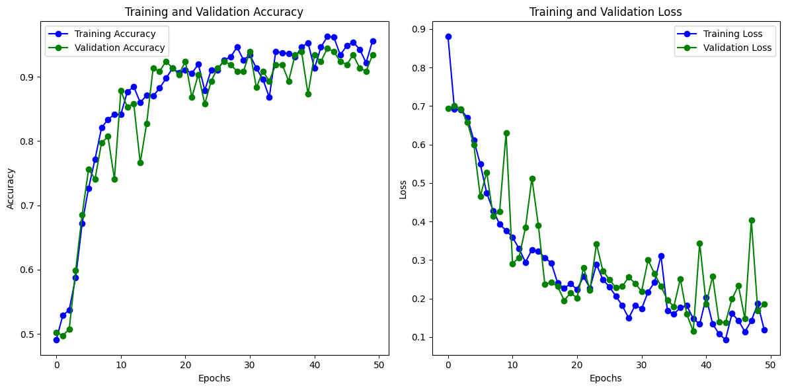

# One Piece Character Classifier

## About Dataset
The dataset used for this project contains images of characters from the anime and manga series One Piece. The dataset is structured with each character's images stored in a separate folder, named after the character. This structure makes it convenient for organizing and processing the dataset for training a model to classify One Piece characters.

## Goal
The goal of this project is to develop an image classifier capable of identifying characters from One Piece. The classifier will be trained on the dataset mentioned above and will be able to classify images into the respective character classes.

## Papers utilizados en la implementación:
- [Image Classification Based On CNN: A Survey](https://www.researchgate.net/publication/355800126_Image_Classification_Based_On_CNN_A_Survey)
- [Binary cross entropy with deep learning technique for
Image classification](https://www.researchgate.net/profile/Vamsidhar-Yendapalli/publication/344854379_Binary_cross_entropy_with_deep_learning_technique_for_Image_classification/links/5f93eed692851c14bce1ac68/Binary-cross-entropy-with-deep-learning-technique-for-Image-classification.pdf)

## 1. ImageDataGenerator for Training, Testing, and Validation

Three instances of `ImageDataGenerator` are created: one for training data (`train_datagen`), one for testing data (`test_datagen`), and one for validation data (`validation_datagen`). Each instance applies the following data augmentation transformations to the images:

- **rescale=1./255**: Normalizes pixel values to the range [0, 1] by dividing each pixel value by 255.
- **rotation_range=90**: Randomly rotates images up to 90 degrees.
- **width_shift_range=0.2**: Randomly shifts images horizontally.
- **height_shift_range=0.2**: Randomly shifts images vertically.
- **shear_range=0.2**: Randomly applies shearing transformations.
- **zoom_range=0.2**: Randomly zooms in on images.
- **horizontal_flip=True**: Randomly flips images horizontally.

### 1.1 Justification
The transformations applied by `ImageDataGenerator` introduce variety into the training, testing, and validation datasets, which helps the model become more robust and generalize better. Normalizing pixel values ensures that the data is in a suitable range for the model, while transformations such as rotation, shifting, shearing, zooming, and flipping introduce variability that can enhance the model's ability to recognize different variations of the anime character images.

### 1.2 Image Data Generators

Image data generators are created for training (`train_generator`), testing (`test_generator`), and validation (`validation_generator`) using the corresponding data directories. All generators have a target size of `(150, 150)` to resize the images to 150x150 pixels. A batch size of 32 is specified for each generator.

- **Train (70%)**: This category will be used to train the model and will contain approximately 70% of the images of each character.

- **Validation (15%)**: The validation category is used to evaluate the model's performance during training. It helps in adjusting the model's hyperparameters to prevent overfitting or underfitting. The validation category will contain around 15% of the images.

- **Test (15%)**: The test category is used to evaluate the model's performance on unseen data. It also contains around 15% of the images of each character.

## 2. Algorithm Selection

### 2.1 Character Classification as an Image Classification Problem

Classifying characters is a classification problem, as it involves identifying and labeling the presence of specific characters within images. Image classification tasks are well-suited for Convolutional Neural Networks (CNNs), which are designed to recognize patterns and features in image data.

In this context, the goal is to accurately identify characters such as Luffy, Zoro, Nami, and others from the One Piece series in various images. This requires the model to learn the unique characteristics of each character, including facial features, clothing, and other visual attributes.

### 2.2 Choosing Between Different Neural Network Models

The choice of neural network model for character classification depends on several factors, including the complexity of the character patterns, the amount of available data, and the requirements for model performance and efficiency.

- **Complexity of Character Patterns**: 
  - **CNN**: Suitable for distinct and well-defined patterns.
  - **ResNet, VGG, Inception**: Better for complex and varied appearances.

- **Amount of Available Data**: 
  - **CNN**: Performs well with large datasets. The project has 31,575 images, supporting the use of a complex CNN model.

- **Model Performance and Efficiency**: 
  - **High Accuracy**: Deeper CNN architectures (e.g., ResNet).
  - **Efficiency**: Lightweight models (e.g., MobileNet, EfficientNet).

### Comparison of Different Neural Network Models

1. **Convolutional Neural Networks (CNNs)**:
   - **Advantages**: Effective for recognizing spatial hierarchies. High accuracy with sufficient data.
   - **Performance**: High accuracy for image classification.

2. **Residual Networks (ResNet)**:
   - **Advantages**: Solves vanishing gradient problem. Allows deeper networks.
   - **Performance**: Excellent for complex tasks. Higher computational resources needed.

3. **Visual Geometry Group (VGG)**:
   - **Advantages**: Simple and uniform architecture.
   - **Performance**: High accuracy but computationally intensive.

4. **Inception Networks**:
   - **Advantages**: Efficient multi-level feature representations.
   - **Performance**: Good accuracy with optimized computation but complex architecture.

### 2.3 Justification for Choosing a Convolutional Neural Network (CNN)

The decision to use a CNN for character classification is justified by:

1. **Distinct Patterns**: One Piece characters have distinct features that CNNs can recognize effectively.
2. **Sufficient Data**: The dataset of 31,575 images is ample for training a CNN.
3. **Proven Effectiveness**: CNNs have a strong track record in image classification.

### Why CNN is the Best Option

1. **Efficiency and Simplicity**: CNNs balance performance and efficiency, unlike deeper models that require more resources.
2. **Sufficient Complexity**: CNNs can capture the visual patterns of One Piece characters without added complexity.
3. **Scalability**: CNNs are flexible and can be adjusted to improve performance.
4. **Resource Management**: CNNs are practical with lower computational power and memory requirements.

A CNN architecture with convolutional and pooling layers, followed by dense layers, is expected to perform well in classifying characters accurately and efficiently, making it the optimal choice for the project.

## 3 Model Architecture Description

The architecture of the Convolutional Neural Network (CNN) used for character classification is designed to efficiently extract features and classify images of One Piece characters. Below is a detailed description of each layer in the model:

1. **Input Layer**:
   - **Input Shape**: (150, 150, 3)
   - The input layer takes an image of size 150x150 pixels with 3 color channels (RGB).

2. **First Convolutional Block**:
   - **Conv2D Layer**: 32 filters, (3, 3) kernel size, 'relu' activation
     - This layer applies 32 convolutional filters of size 3x3 to the input image, detecting low-level features such as edges.
   - **MaxPooling2D Layer**: (2, 2) pool size
     - This layer reduces the spatial dimensions by half, retaining the most significant features and reducing computational complexity.

3. **Second Convolutional Block**:
   - **Conv2D Layer**: 64 filters, (3, 3) kernel size, 'relu' activation
     - This layer applies 64 convolutional filters, detecting more complex features.
   - **MaxPooling2D Layer**: (2, 2) pool size
     - This layer further reduces the spatial dimensions.

4. **Third Convolutional Block**:
   - **Conv2D Layer**: 128 filters, (3, 3) kernel size, 'relu' activation
     - This layer applies 128 convolutional filters, detecting even more complex features and patterns.
   - **MaxPooling2D Layer**: (2, 2) pool size
     - This layer reduces the spatial dimensions once more.

5. **Flatten Layer**:
   - **Flatten**: Converts the 3D feature maps to a 1D feature vector to prepare for the fully connected layers.

6. **Fully Connected Layers**:
   - **Dense Layer**: 512 units, 'relu' activation
     - This layer consists of 512 neurons with ReLU activation, providing the capacity to learn intricate patterns in the data.
   - **Dense Layer**: 18 units, 'sigmoid' activation
     - The output layer consists of 18 neurons with sigmoid activation, corresponding to the 18 classes of One Piece characters. The sigmoid activation function is used for multi-class classification.

## 4. Result of the model

### 4.1 Training and validation accuracy/loss

- The model appears to be successfully learning from the training data, achieving high training accuracy and low training loss.
- There are signs of overfitting, as the validation accuracy is lower than the training accuracy, and the validation loss is slightly higher than the training loss.
- Despite the overfitting, the validation accuracy is still relatively high, which means the model generalizes somewhat well to unseen data.

### 4.2 Metrics

- - Accuracy:  0.5329949238578681
- - Precision: 0.5331
- - Recall: 0.5330
- - F1-score: 0.5329

- The model's performance is slightly above random guessing. The accuracy of 0.533 suggests the model can distinguish between Chopper and Jinbe to some extent, but there's still room for improvement.
- There are still some misclassified Jinbe images labelled as Chopper.
- The model misses some Chopper images.

## 5. Model improovements
The improved model contribute to better performance in classifying, these are the characteristics of the new model:

- Regularization: This helps prevent overfitting by penalizing large weights, encouraging the model to learn more generalizable features.
- Batch Normalization: This technique helps normalize the activations of neurons, accelerating training and potentially improving performance.
- Dropout: This randomly drops out a percentage of neurons during training, preventing the model from overfitting to specific training examples.
- Hyperparameter Tuning: This hyperparameter tuning can significantly impact the model's ability to learn and converge.

### 5.1 Training and validation accuracy/loss

The trends in accuracy and loss for the new model strongly suggest that the changes were effective. The new model with L2 regularization, BatchNormalization, Dropout, and potentially a better learning rate is performing significantly better than the previous model.

- Validation Accuracy: The new model generalizes better to unseen data, achieving a high validation accuracy close to 1.
- Validation Loss: The new model shows less overfitting compared to the previous model, with the validation loss remaining lower than the training loss.

### 5.2 Metrics

- Accuracy:  0.5736040609137056
- Precision: 0.5744
- Recall: 0.5736
- F1-score: 0.5719

## 6. Conclusions
While the new model shows some improvement in terms of overfitting based on the accuracy and loss , the overall performance metrics (accuracy, precision, recall, F1-score) haven't seen a significant leap compared to the previous model (accuracy: 0.533).

### Previous Model:
- The previous model likely struggled with overfitting, leading to a moderate accuracy (around 0.53) on unseen data.
- It might have had issues differentiating between Chopper and Jinbe in some cases.

### New Model:
- The new model's accuracy (0.57) on the test dataset shows a slight improvement, suggesting it generalizes a bit better than the previous model.
However, the precision (0.5744), recall (0.5736), and F1-score (0.5719) remain relatively low, indicating that the model still struggles with correctly classifying.

### Possible Reasons for Limited Improvement:
- Data Size: The size and diversity of the training data might be insufficient for the model to learn robust features for distinguishing the two characters.
- Model Complexity: The current architecture might not be complex enough to capture the differences between Chopper and Jinbe.
- Hyperparameter Tuning: The learning rate or other hyperparameters might not be optimally tuned for this specific problem.

## How to Download the Dataset
You can download the dataset from [Kaggle](https://www.kaggle.com/datasets/ibrahimserouis99/one-piece-image-classifier?select=Data). Please note that the images in this dataset are not owned by the creator of this project.

## Download the model:
You can download the models here:

[Modelv1](https://drive.google.com/file/d/1A9rezvoUsA1O-5YJ-SS3RBCAKnACDYG4/view?usp=sharing)

[Modelv2](https://drive.google.com/file/d/1XpYVzHuF9k2RJM3ZyGmeYBh8rX1ps-2m/view?usp=sharing)

## How to use the program
1. Download the dataset
2. Extract all the files
3. Copy and Paste the folder called /Data in to the folder of the repository Artificial Intelligence
4. Uncomment the function setup_and_split_dataset from the code
5. Run the code